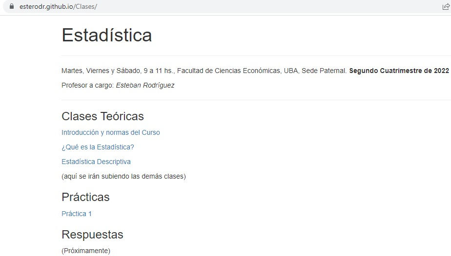

```{r setup, include=FALSE}
knitr::opts_chunk$set(echo = FALSE)
```

# En cuatrimestres previos...

Este curso estaba a cargo de **Tamara Burdisso**

El programa de la materia es el mismo

Al contenido de las clases teóricas y prácticas sólo se le realizaron ligeras adaptaciones

Si algún alumno ya cursó con Tamara, no encontrará grandes diferencias respecto a este curso.

---

# Canales de Comunicación


El Campus se utilizará para

- Avisos importantes/urgentes
- Videos de las Clases Virtuales (En Materiales)

Para todo lo demás, preferimos la utilización de **Slack**

---

# Canales de Comunicación


[https://esterodr.github.io/Clases/](https://esterodr.github.io/Clases/)

Todo el material de las clases teóricas y prácticas se irá subiendo ahí

---

# Canales de Comunicación


- Recibirán un mail con el link de acceso

- Links a clases teóricas y prácticas 

- Respuesta a dudas y consultas

---

# Normas de Evaluación

- Hay que aprobar 2 exámenes parciales

- Sólo se puede recuperar 1 examen

- Si la nota promedio es 7 o más, se promociona

- Si la nota promedio es menos de 7, se debe dar un final

- Un parcial ausente y uno desaprobado = Desaprobado

- Un parcial ausente y uno aprobado = Ausente

---

# Fechas de Exámenes

*A confirmar*

- Primer Parcial: Sábado 1 de Octubre

- Segundo Parcial: Sábado 26 de Noviembre

- Recuperatorio: Viernes 2 de Diciembre

- Final: Martes 6 de Diciembre

---

# TP en R

Hay un Trabajo Práctico en el Lenguaje de Programación R **Optativo**

- En dos partes, con temas del primer y segundo parcial
- No es necesario saber programar
- Se trabaja en un entorno virtual (no hay que instalar nada en la computadora)
- Quienes lo entreguen recibirán una devolución sin nota por parte de los docentes

En el TP se realizan simulaciones de procesos aleatorios imposibles de realizar en clase

Si bien es optativo, **se recomienda hacerlo** ya que en la clase muchas veces vamos a hacer referencia a los resultados.

---

# Programa (1er Parcial)

- **Unidad 1**. La naturaleza de la estadística: Muestreo aleatorio. Experimentos aleatorizados. El experimento ideal. Fuentes y tipos de datos. Datos observacionales vs. datos experimentales. Estructura de los datos: corte transversal, series de tiempo y datos de panel. Análisis exploratorio de datos. Estadística descriptiva. Desigualdad de Chebyshev. Histogramas, box-plots, diagrama de puntos, series de tiempo. Números índices de precios y cantidades.

- **Unidad 2**. Conjuntos y métodos de conteo. Probabilidades. Eventos disjuntos. Eventos independientes. Probabilidad condicional. Teorema de Bayes. Distribución de probabilidades. Media y varianza. Variables aleatorias discretas. Bernoulli y la distribución binomial. La distribución de Poisson. Aproximación de Poisson a la Binomial. Distribuciones bivariadas. Covarianza. Correlación. Combinación lineal de variables aleatorias. Variables aleatorias continuas. La distribución uniforme. La distribución normal. Aproximación de la Binomial a la Normal.

---

# Programa (2do Parcial)

- **Unidad 3**. Introducción a la inferencia. Muestreo aleatorio. Parámetro y estimador. La distribución muestral. La forma de las distribuciones muestrales. Ley de los grandes números. Teorema Central del Límite. Muestras pequeñas. Boostraping. Introducción a la inferencia vía simulación.

- **Unidad 4**. Inferencia basada en una muestra. Estimación puntual para la media, proporción y varianza. Intervalo de confianza. Test de hipótesis. Relación entre intervalo de confianza y test de hipótesis. Error de tipo I y error de tipo II.

- **Unidad 5**: Inferencia basada en dos muestra. Test de hipótesis para dos muestras. 

- **Unidad 6**: El modelo de regresión lineal. Método de estimación. Cuadrados mínimos ordinarios. Variabilidad muestral. Intervalo de confianza y test para β. Predicción de Y dado X. 

---

# Bibliografía

- **Newbold, Paul (2008)**. Sexta Edición. Estadística para los negocios y la economía. Pearson. Prentice Hall
- **Anderson,D., Sweeney D., y Williams T. (1999)**. Séptima edición. Estadística para administración y economía. Thomson Editors.
- **Wackerly, D., Mendenhall, W. y Scheaffer, R., (2002)**. Sexta Edición. Estadística Matemática con Aplicaciones. Thomson Editors.
- **Harnett y Murphy (1987)**. Addison- Wesley, Iberoamericana. Introducción al análisis estadístico
- **Ross, Sheldon Ross (2007)**. Introducción a la estadística. Editorial Reverte.
- **Levine, David, Krehbiel Timothy y Berenson Mark (2006)**. Cuarta edición. Estadística para Administración
- **Walpole, R. y Myers, R. (1998)**. Sexta Edición. Probabilidad y Estadística para Ingenieros. Pearson Educación
- **Wonnacott T. y Wonnacott R. (1990)**. Introductory Statistics for Business and Economics. John Wiley and Sons.
- **Diez, D., Barr, C., y Cetinkaya-Rundel, M. (2013)**. OpenIntro Statistics.

---

# Bibliografía para seguir con Estadística II

- **Rice, J. A. (2007)**, Third edition. Mathematical Statistics and Data Analysis. Thomson
- **Gujarati, D. (2009)**, Quinta edición. Econometría, McGRAW-HILL
- **Knight, K. (2000)**. Mathematical Statistics, Chapman & Hall
- **DeGroot, M. (4th Edition) Probability and Statistics (Classic Version)**, Pearson Modern Classics for Advanced Statistics Series
- **Canavos, (1988)**. Probabilidad y estadística. McGraw-Hill

---

# Apuntes en español

Armados en base a diferentes libros disponibles en **COPY.AR (+54 9 11 6398-8775)**

- Unidad 1: capítulos 1, 2 y 3 de Anderson,D., Sweeney D., y Williams T. (1999). Séptima edición. Estadística para administración y economía. Thomson Editors
- Unidad 1 (Números Índice): Capítulo 17 Anderson,D., Sweeney D., y Williams T. (1999). Séptima edición. Estadística para administración y economía. Thomson Editors
- Unidad 2, 3, 4 y 5: Capítulos 4, 5, 6, 7, 8, 9, 10 y 11 de Newbold, Paul (2008) . Sexta Edición. Estadística para los negocios y la economía. Pearson. Prentice Hall
- Unidad 6: Capítulos 2, 3, 4 y 5 Gujarati, D. (2009), Quinta edición. Econometría, McGRAW-HILL

---

# Recomendaciones generales

- Llevar la materia al día.

- Sentarse a practicar y a hacer ejercicios. No alcanza con venir a clase.

- Se requieren conocimientos previos de Álgebra y Análisis Matemático (funciones, derivadas, integrales, sistemas de ecuaciones, procedimientos algebraicos en general, etc.). Si no se tienen en claro estos temas, se sugiere repasarlos. Ver [Práctica 0](Práctica-0.html)

- Hacer el TP en R, aunque sea como práctica (sin entregarlo).
