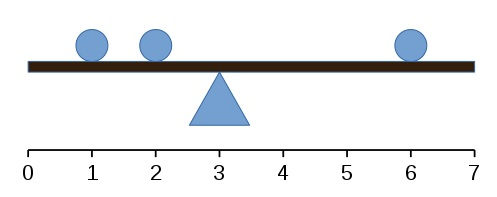
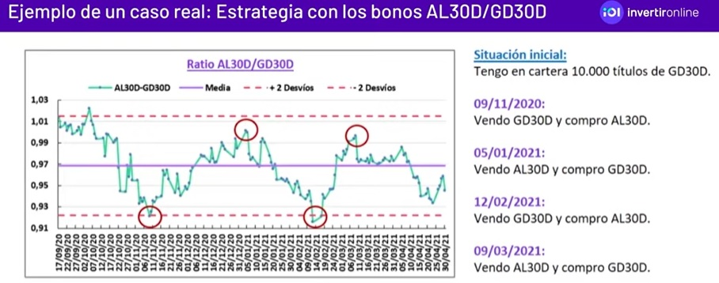
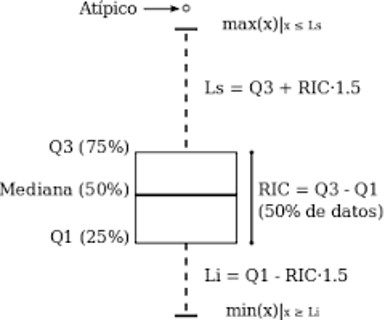
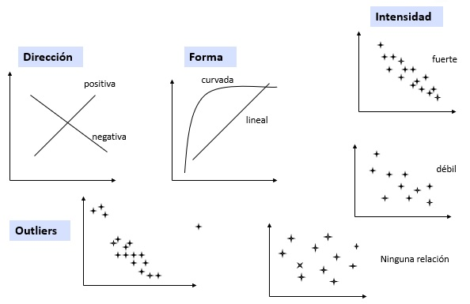
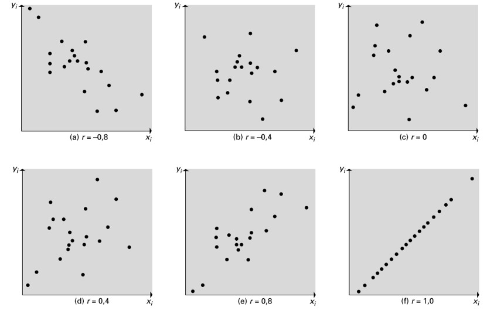
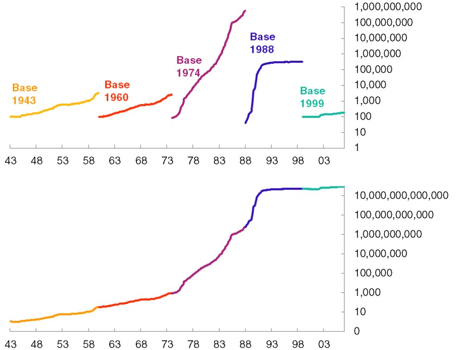

```{r setup, include=FALSE}
knitr::opts_chunk$set(echo = FALSE, warning = FALSE, message = FALSE)
```

# Estadística descriptiva

- Primer análisis de un conjuntos de datos

  + A través de un grupo de medidas resumen: **métodos numéricos**.
  
  + A través del análisis exploratorio: **métodos gráficos y tabulares**.
  
---

# Métodos Numéricos

- Para resumir la información de un conjunto de datos, la estadística dispone de unas pocas medidas que concentran la máxima información -no más de 6 valores- que brindan un idea clara del comportamiento general de los datos.

--

- Estas medidas suelen presentarse en tres grandes grupos:

  + De tendencia central
  + De dispersión
  + De posición

---

# De tendencia central: la media

La **media o promedio aritmético** es la medida de tendencia central más popular (fácil de entender y de calcular)

$$\overline{x}=\frac{x_1+x_2+...+x_n}{n}=\frac{\sum_{i=1}^{n} x_i}{n}=\frac{1}{n}\sum_{i=1}^{n} x_i$$

La media puede interpretarse como el punto que equilibria la balanza de los datos:



En este caso, $\overline{x}=\frac{1+2+6}{3}=9$

Pero si algún $x_i$ cambia su valor, la media también cambiará su valor.

---

# De tendencia central: la media

Ejemplo: Considere el siguiente conjunto de datos: 6, 7, 5, 2, 3, 8, 9

$$\overline{x}=\frac{6+7+5+2+3+8+9}{7}=5,71$$

--

¿Qué pasa si tipeamos mal un número?

$$\overline{x}=\frac{6+7+5+2+3+8+\color{red}{99}}{7}=\color{red}{18,57}$$

--

Gran sensibilidad de la media a la presencia de valores extremos / atípicos / inusuales / anómalos / outliers (todas estas palabras son sinónimos).

---

# Media de datos agrupados

En una empresa la edad media de sus trabajadores es de 36 años para los hombres y 32 para las mujeres. ¿Cuál es la edad media de sus trabajadores? 

--

Suponiendo $n_1$ hombres y $n_2$ mujeres:

$$\frac{1}{n_1+n_2}\sum_{i=1}^{n_1+n_2} x_i=\frac{1}{n_1+n_2}(\sum_{i=1}^{n1} x_i^H + \sum_{i=1}^{n2} x_i^M)=$$

--

$$=\frac{1}{n_1+n_2}(\overline{x}^H*n_1+\overline{x}^M*n_2)=$$

--

$$=\overline{x}^H\frac{n1}{n_1+n_2}+\overline{x}^M\frac{n2}{n_1+n_2}=\overline{x}^H*f_1+\overline{x}^M*f_2$$


---

# De tendencia central: la mediana

- La mediana es el valor que al ordenar los datos de menor a mayor, queda exactamente en el medio.

--

- En el ejemplo anterior la mediana es: $2, 3, 5, \color{red}6, 7, 8, 9$

--

- Y **si ingresamos mal un número extremo, la mediana no cambia**: $2, 3, 5, \color{red}6, 7, 8, \color{red}{99}$ 

--

- **Escasa influencia de los valores extremos de la muestra. Se dice que la mediana es una medida central robusta (a la presencia de valores extremos)**.

- Más recomendable que la media cuando se trabaja con datos que aún no han sido depurados.

- Es la medida de tendencia central que se debería mirar cuando se analizan variables como salarios, ingresos totales, etc.

---

# De tendencia central: la mediana

- ¿Cómo se calcula la mediana cuando el nro. de observaciones es par?

- Se toma el promedio de los valores centrales.

$$2, 3, 5, \color{red}{5, 6}, 7, 8, 9$$
$$Mediana=\frac{5+6}{2}=5,5$$

---

# De tendencia central: la moda

- **La moda es el valor más frecuente**. En $2, 3, \color{red}{5, 5}, 6, 7, 8, 9$, es el 5 porque es el único que aparece 2 veces. 

- Puede haber más de una moda. Si la muestra fuese $2, 3, \color{red}{5, 5}, 6, 7, 8, \color{red}{9, 9}$ entonces la moda es 5 y 9.

- **Tiene más sentido con datos cualitativos**. Ej. en una muestra, el color de ojos más frecuente.

- Su presencia como medida de tendencia central se debe más a la tradición que a su utilidad.

---

# De dispersión

- ¿Alcanza con las medidas de tendencia central para caracterizar a un conjunto de datos? NO.

--

- Un viejo chiste dice que: "Un estadístico podría meter su cabeza en un horno y sus pies en hielo y decir que en promedio se encuentra bien".

--

- Esto puede sonar exagerado, pero es lo que sucede con muchas variables económicas.

- Ejemplo, al decir que el PIB per cápita de Argentina es 8.500 dólares, ¿tenemos una idea clara sobre las condiciones de vida en el país?

--

- Resumir toda la información en un número sin atender a la variabilidad que presentan los datos es un problema grave.

```{r fig.height = 1}
library(tidyverse)
data <- data.frame(x=c(-10,-9,-8,-7,-6,6,7,8,9,10,-1,-0.8,-0.6,-0.4,-0.2,1,0.8,0.6,0.4,0.2),
                   y=c(rep(1,10),rep(0,10)))
data %>% ggplot(aes(x=x,y=y,color=factor(y))) +
  geom_point(size=5) +
  scale_color_manual(values=c("red","blue")) +
  geom_hline(yintercept = 0) +
  geom_hline(yintercept = 1) +
  geom_segment(aes(x=0,xend=0,y=-0.1,yend=0.1), color="black") +
  geom_segment(aes(x=0,xend=0,y=0.9,yend=1.1), color="black") +
  theme(panel.background = element_blank(),
        axis.title  = element_blank(),
        axis.ticks = element_blank(),
        axis.text = element_blank(),
        legend.position =  "none")
```


- **Se debe entonces cuantificar la dispersión**

---

# De dispersión: rango

- El **rango es la diferencia entre el valor máximo y el mínimo observado** en la muestra.

- Ejemplo: En $2, 3, 5, 5, 6, 7, 8, 9$, El Rango es $9-2=\color{red}7$

- Medida muy sencilla pero poco confiable. Sólo tiene en cuenta los extremos del conjunto de datos. Podrían ser anómalos.

- Su utilidad puede estar en muestras pequeñas (menos de 10 datos) o en aquellas donde estamos seguros que no hay valores atípicos..

---

# De dispersión: varianza y desvío

- Una forma usual de cuantificar la dispersión es medir qué tan concentrados están los datos en torno a la media. O, lo que es lo mismo, medir qué tan lejos están de la media. 

--

- Supongamos que tenemos la siguiente muestra: $1, 2 ,4 ,7, 9$. La media es **`r mean(c(1,2,4,7,9))`** ¿Qué tan lejos están los valores de la media?

--

| $x_i$ | $x_i-4,6$  | 
| :---: |:----------:|
| 1     | `r 1-4.6`  | 
| 2     | `r 2-4.6`  |
| 4     | `r 4-4.6`  |
| 7     | `r 7-4.6`  |
| 9     | `r 9-4.6`  |
| $\sum_{i=1}^n(x_i-4.6)$ | $\color{red}0$ |

**¡Medir la dispersión de esta forma no nos sirve de nada!**

---

# De dispersión: varianza y desvío

Puede comprobarse que esta suma siempre da cero $\sum_{i=1}^n(x_i-\overline{x})$

Demostrar:

--

$\sum_{i=1}^n(x_i-\overline{x})=\sum_{i=1}^n(x_i)-\sum_{i=1}^n(\overline{x})=$

$=\sum_{i=1}^n(x_i)-n*\overline{x}=$

$=\sum_{i=1}^n(x_i)-n*\frac{\sum_{i=1}^n(x_i)}{n}=$

$=\sum_{i=1}^n(x_i)-\sum_{i=1}^n(x_i)=0$

- En todo conjunto de datos hay valores por encima y por debajo de la media. Y estas diferencias siempre se compensan.

- Solución: considerar las diferencias al cuadrado (todos términos positivos) $\sum_{i=1}^n(x_i-\overline{x})^2$

---

# De dispersión: varianza y desvío

La **Varianza Muestral** es una de las formas más usuales de medir la dispersión

$$s^2=\frac{\sum_{i=1}^n(x_i-\overline{x})^2}{n-1}$$

Es un *estimador* de la varianza poblacional $\sigma^2$. ¿Por qué dividimos por $n-1$ y no por $n$? Lo veremos más adelante.

--

Inconveniente: **las unidades de la varianza son las mismas que la de los datos elevadas al cuadrado**. Difícil de interpretar. Por eso se suele utilizar el **desvío estándar**, que expresa todo en las mismas unidades que las observaciones.

$$s=\sqrt{s^2}=\sqrt{\frac{\sum_{i=1}^n(x_i-\overline{x})^2}{n-1}}$$

Al igual que la media aritmética, la varianza y el desvío estándar son **muy sensibles a la presencia de valores extremos**.

---

# De dispersión: varianza y desvío

¿Cómo se calculan la varianza y el desvío?

|      | $x_i$ | $(x_i-\overline{x})$  |  $(x_i-\overline{x})^2$ |
|:---: | :---: |:----------:|:----------:|
|      | 2     | `r 2-4.83`  |  `r round((2-4.833333)^2,2)`  |
|      | 4     | `r 4-4.83`  | `r round((4-4.833333)^2,2)`  |
|      | 3     | `r 3-4.83`  | `r round((3-4.833333)^2,2)`  |
|      | 8     | `r 8-4.83`  | `r round((8-4.833333)^2,2)`  |
|      | 5     | `r 5-4.83`  | `r round((5-4.833333)^2,2)`  |
|      | 7     | `r 7-4.83`  | `r round((7-4.833333)^2,2)`  |
|      |      |  |   |
| $\sum_{i=1}^n(x_i)$ | `r sum(c(2,4,3,8,5,7))` | $\sum_{i=1}^n(x_i-\overline{x})^2$ | `r round(sum((c(2,4,3,8,5,7)-4.8333)^2),2)` |
| $n$ | 6 | $\color{red}{s^2}$  | $\color{red}{`r round(var(c(2,4,3,8,5,7)),2)`}$ |
| $\overline{x}$ | `r round(mean(c(2,4,3,8,5,7)),2)` | $\color{red}s$ | $\color{red}{`r round(sd(c(2,4,3,8,5,7)),2)`}$ |

---

# De dispersión: varianza y desvío

- ¿Por qué usamos las desviaciones respecto de la media al cuadrado en el cálculo de la varianza?

--

- Porque es una forma fácil de deshacerse de los valores negativos, y así las observaciones que se encuentran a la derecha y/o a la izquierda son penalizadas de la misma manera.

- Y como se trata de una función cuadrática cuanto más lejos están de la media más ponderan, i.e más aumenta la variabilidad.

--

- Tener presente que la varianza y el desvío estándar **no son dos medidas diferentes de dispersión**. Cuando se conoce una de ellas, inmediatamente se conoce la otra.

---

# De dispersión: coeficiente de variación

- ¿Qué medida utilizar cuando se quiere comparar la variabilidad de dos muestras de poblaciones diferentes?

- Dado que la varianza y el desvío estándar se canculan en relación a la media, comparar varianzas de muestras con distintas medias puede no ser adecuado.

--

- El **Coeficiente de Variación** $CV=\frac{s}{\overline{x}}$ expresa al desvío estándar como proporción de la media. Es una medida sin unidades.

- Cuanto mayor el $CV$, mayor es la dispersión o variabilidad de los datos.

- El coeficiente de variación es capaz de lidiar con los problemas de dimensionalidad de las variables de distintas muestras (e.g. peso y altura) y problemas de diferencia enormes en las medias de las muestras (e.g. peso de los elefantes y de las hormigas).

---

# De dispersión: coeficiente de variación

Ejemplo: ¿Qué tiene más variabilidad, el peso o la altura?

|     | Peso en kg. | Altura en cm. |
|:---:|:-----------:|:-------------:|
| $\overline{x}$ | 74,5 | 168,8 |
| $s$ | 13 | 14 |
| $CV$ | $\frac{13}{74,5}=0,1745$ | $\frac{14}{168,8}=0,0829$ |

--

- Algunas limitaciones:

  + La media debería ser positiva (i.e. las observaciones positivas o nulas), porque el CV es una medida de variabilidad y por ende es nula o positiva.
  
  + Cuando la media es cercana a 0 ( el aumento en el CV no necesariamente se debe a mayor variabilidad en los datos) el CV pierde significado.

---

# Otras medidas: Cuartiles (Q1,Q2 y Q3)

- Recordemos que la **mediana** es el valor que deja 50% de los datos a izquierda y 50% a derecha. Se la suele llamar también **Segundo Cuartil o Q2**.

- El **Primer Cuartil o Q1** es el valor que deja 25% de los datos a la izquierda y 75% a la derecha.

- El **Tercer Cuartil o Q3** es el valor que deja 75% de los datos a la izquierda y 25% a la derecha.

```{r fig.height = 1}
ggplot() +
  geom_segment(aes(x=0,xend=1,y=0,yend=0), color="red", size=1) +
  geom_segment(aes(x=0.25,xend=0.25,y=-0.1,yend=0.1), color="red", linetype="dotted") +
  geom_segment(aes(x=0.5,xend=0.5,y=-0.1,yend=0.1), color="red", linetype="dotted") +
  geom_segment(aes(x=0.75,xend=0.75,y=-0.1,yend=0.1), color="red", linetype="dotted") +
  geom_text(aes(x=0.25,y=0.2,label="Q1"))+
  geom_text(aes(x=0.5,y=0.2,label="Q2"))+
  geom_text(aes(x=0.75,y=0.2,label="Q3"))+
  geom_text(aes(x=0.125,y=0.1,label="25%"))+
  geom_text(aes(x=0.375,y=0.1,label="25%"))+
  geom_text(aes(x=0.625,y=0.1,label="25%"))+
  geom_text(aes(x=0.875,y=0.1,label="25%"))+
  theme(panel.background = element_blank(),
        axis.title  = element_blank(),
        axis.ticks = element_blank(),
        axis.text = element_blank(),
        legend.position =  "none")
```

- Q1, Q2 y Q3 son **medidas de posición**, para establecer “mojones”.

---

# Otras medidas: Rango Intercuartílico

- **Rango intercuartílico**: RIC (IQR son las siglas en inglés) Se calcula como $Q3-Q1$.

- Corresponde al 50% de los datos. En particular, al 50% del medio.

- Se trata de una medida de dispersión que elimina la influencia de los valores extremos. **El RIC es una medida robusta de dispersión**.

Ejemplo: dada la muestra 2825, 2380, 2210, 2630, 2255, 2380, 2350, 2390, 2440, 2450, 2420, 2550. Hallar Q1, Q2 y Q3.

--

Primero, ordenamos de menor a mayor: `r c(2825, 2380, 2210, 2630, 2255, 2380, 2350, 2390, 2440, 2450, 2420, 2550)[order(c(2825, 2380, 2210, 2630, 2255, 2380, 2350, 2390, 2440, 2450, 2420, 2550))]`

--

Al ser 12 datos: Q1 debe dejar 3 a la izquierda y 9 a la derecha; Q2 debe dejar 6 a cada lado y Q3 9 a la izquierda y 3 a la derecha.

$Q1=\frac{2350+2380}{2}=2365,     Q2=\frac{2390+2420}{2}=2405,    Q3=\frac{2450+2550}{2}=2500$

---

# Otras medidas de posición

**Percentiles**: El p-ésimo percentil es un valor tal que por lo menos un $p\%$ de los elementos tiene este valor o menos, y al menos un $(100-p)\%$ tienen este valor o más.

Percentiles “famosos”: los percentiles de las tablas de pesos de los pediatras; los deciles de la distribución del ingreso, etc.

--

¿Cómo se calculan?

- Ordenar de menor a mayor los datos

--

- Calcular el índice $i=n*(\frac{p}{100})$ donde $p$ es el percentil de interés y $n$ es la cantidad de observaciones en la muestra.

--

- Si $i$ no resulta entero, el valor entero inmediato mayor que $i$, indica la posición del p-esimo percentil.

- Si $i$ es entero, el p-ésimo percentil es el promedio de los valores de los datos ubicados en los lugares $i$ e $i+1$

---

# Otras medidas de posición

Ejemplo: dada la muestra 2825, 2380, 2210, 2630, 2255, 2380, 2350, 2390, 2440, 2450, 2420, 2550, hallar el **Percentil 20**

--

Calculamos $i=12*(\frac{20}{100})=2,4$

Como no es entero, tomamos el entero siguiente: 3.

$2210, 2255, \color{red}{2350}, 2380, 2380, 2390, 2420, 2440, 2450, 2550, 2630, 2825$

Entonces, el **percentil 20 es 2350**

--

Hallar el percentil 50

--

Calculamos $i=12*(\frac{50}{100})=6$

Como es entero, tomamos el promedio de las posiciones 6 y 7.

$2210, 2255, 2350, 2380, 2380, \color{red}{2390, 2420}, 2440, 2450, 2550, 2630, 2825$

Entonces, el **percentil 20 es** $\frac{2390+2420}{2}=2405$

---

# Resumiendo

¿Quién está menos afectado por los valores extremos, la media o la mediana? ¿Y quién entre el desvío estándar y el RIC?

--

|     | Robusta | No Robusta |
|:---:|:-----------:|:-------------:|
| De Tendencia Central | Q2=Mediana | Media |
| De Dispersión | IQR | Desvío Estándar, Rango |

---

# Medidas de localización relativa

Supongamos que se dispone de una muestra de datos de tamaño $n$, $x_1, x_2, ..., x_n$ y que conocemos su media $\overline{x}$ y su desvío estándar $s$.

**Valor z o valor estandarizado** para la observación $i$: $z_i=\frac{x_i-\overline{x}}{s}$

El valor $z_i$ se interpreta como la cantidad de desviaciones estándar que la observación $x_i$ dista de $\overline{x}$

--

Ejemplo: 46, 54, 42, 46, 32 

$\overline{x}=44, s=8$

--

| $x_i$  | $z_i$ |
|:------:|:-----:|
|46| `r round((46-44)/8,2)` |
|54| `r round((54-44)/8,2)` |
|42| `r round((42-44)/8,2)` |
|46| `r round((46-44)/8,2)` |
|32| `r round((32-44)/8,2)` |

---

# Medidas de localización relativa

- $z_i=1,5$ indica que $x_i$ es 1,5 desvíos estándars mayor a la media.

- $z_i=-0,5$ indica que $x_i$ está a 1/2 desvío estándar por debajo de la media.

- Valores $z$ mayores que cero indican que la observación es mayor a la media. Valores $z$ menores que cero indican observaciones por debajo de la media. Valores $z$ igual a cero corresponden a datos iguales al promedio.

- Para cualquier elemento de la muestra el valor $z$ indica la ubicación relativa del elemento en un conjunto de datos.

- Si los elementos de dos diferentes conjuntos de datos tienen el mismo valor $z$, se puede afirmar que poseen la misma ubicación relativa.

- **Criterio para determinar valores atípicos**:

  + Un valor $x_i$ **es atípico** si $|z_i|>3$, es decir, si $z_i<-3$ o $z_i>3$
  
  + Un valor $x_i$ **no es atípico** si $|z_i|<2$, es decir, si $-2<z_i<2$
  
  + Si $-3<z_i<-2$ ó $2<z_i<3$, es un caso dudoso, hay que analizar el conjunto de los datos para determinar si $x_i$ es atípico o no.

---

# Teorema de Chebyshev

La desigualdad de Chebyshev permite inferir el porcentaje de elementos (observaciones) que deben quedar dentro de una cantidad específica de desvíos estándar respecto a la media. Proporciona una **cota inferior** para la distribución de los datos, sin importar como se distribuyen ni la variabilidad que exhiban.

--

**Teorema**: dado un número $k>1$ y una muestra $x_1,x_2,...,x_n$, **por lo menos el** $100*(1-\frac{1}{k^2})$ de las observaciones, estará dentro del intervalo $(\overline{x}-k*s, \overline{x}+k*s)$

| k o valor z |            |
|:-----------:|:-----------|
|2|Por lo menos, el `r round(100*(1-1/2^2),1)`% de las observaciones está a menos de 2 desvíos de la media|
|3|Por lo menos, el `r round(100*(1-1/3^2),1)`% de las observaciones está a menos de 3 desvíos de la media|
|4|Por lo menos, el `r round(100*(1-1/4^2),1)`% de las observaciones está a menos de 4 desvíos de la media|
|5|Por lo menos, el `r round(100*(1-1/5^2),1)`% de las observaciones está a menos de 5 desvíos de la media|


---

# Aplicación en mercados financieros



--

- Idea: 2 desvíos estándars suele ser una distancia muy grande


---

# Métodos Gráficos

Vamos a ver algunos herramientas usuales para analizar:

- Variables numéricas

- Relación entre dos variables

- Variables categóricas

- Series de Tiempo

---

# Variables Numéricas: Histograma

Tenemos información sobre la expectativa de vida en 142 países, para el año 2007

```{r}
library(gapminder)
datos <- gapminder
names(datos) <- c("Pais", "Continente", "Año", "Expectativa_de_vida", "Poblacion", "PIB_per_capita")
datos <- datos %>% filter(Año==2007) %>% select("Pais", "Expectativa_de_vida")
datos %>% head(10) %>% knitr::kable()
```

---

# Variables Numéricas: Histograma

Agrupamos los valores de expectativa de vida en **"clases"**. Por ejemplo, en intervalos de 5 años. Contamos cuántos países hay en cada clase

```{r}
clases <- hist(datos$Expectativa_de_vida, plot = FALSE, breaks = 'Sturges')
datos_tabla <- tibble(Clase = c("[35-40)","[40-45)","[45-50)","[50-55)","[55-60)",
                                "[60-65)","[65-70)","[70-75)","[75-80)","[80-85)"),
                      Frecuencia = clases$counts)
datos_tabla$Porcentaje <- round(datos_tabla$Frecuencia/sum(datos_tabla$Frecuencia)*100,2)
datos_tabla$Frecuencia_Acumulada <- cumsum(datos_tabla$Frecuencia)
datos_tabla$Porcentaje_Acumulado <- cumsum(datos_tabla$Porcentaje)
knitr::kable(datos_tabla)
```

---

# Variables Numéricas: Histograma

.pull-left[
Frecuencia Absoluta
```{r}
datos %>% ggplot(aes(x=Expectativa_de_vida)) +
  geom_histogram(bins = 8, fill="blue",color="black",breaks=c(seq(35,85,5))) +
  labs(title = "", x="", y="") +
  theme(panel.grid.major.x = element_blank(),
        panel.grid.minor.x = element_blank())
```
]

.pull-right[
Frecuencia Relativa
```{r}
datos %>% ggplot(aes(x=Expectativa_de_vida)) +
  geom_histogram(aes(y = 100*(..count..)/sum(..count..)),
                 bins = 8, fill="blue",color="black",breaks=c(seq(35,85,5))) +
  labs(title = "", x="", y="") +
  theme(panel.grid.major.x = element_blank(),
        panel.grid.minor.x = element_blank())
```
]

La utilidad del histograma radica en revelar rápidamente la forma de la distribución de los datos.

---

# Variables Numéricas: Histograma

¡Cuidado con el ancho de clase! Puede alterar la historia de lo que se está contando.

.pull-left[
```{r fig.height=4}
datos %>% ggplot(aes(x=Expectativa_de_vida)) +
  geom_histogram(bins = 3, fill="blue",color="black") +
  labs(title = "", x="", y="") +
  theme(panel.grid.major.x = element_blank(),
        panel.grid.minor.x = element_blank())
```
]

.pull-right[
```{r fig.height=4}
datos %>% ggplot(aes(x=Expectativa_de_vida)) +
  geom_histogram(bins = 8, fill="blue",color="black") +
  labs(title = "", x="", y="") +
  theme(panel.grid.major.x = element_blank(),
        panel.grid.minor.x = element_blank())
```
]

.center[
```{r fig.height=4}
datos %>% ggplot(aes(x=Expectativa_de_vida)) +
  geom_histogram(bins = 30, fill="blue",color="black") +
  labs(title = "", x="", y="") +
  theme(panel.grid.major.x = element_blank(),
        panel.grid.minor.x = element_blank())
```
]

---

# Variables Numéricas: Histograma

.pull-left[
Frecuencia Absoluta Acumulada
```{r}
datos %>% ggplot(aes(x=Expectativa_de_vida)) +
  geom_histogram(aes(y=cumsum(..count..)),
                 bins = 8, fill="blue",color="black",breaks=c(seq(35,85,5))) +
  labs(title = "", x="", y="") +
  theme(panel.grid.major.x = element_blank(),
        panel.grid.minor.x = element_blank())
```
]

.pull-right[
Frecuencia Relativa Acumulada
```{r}
datos %>% ggplot(aes(x=Expectativa_de_vida)) +
  geom_histogram(aes(y = cumsum(100*(..count..)/sum(..count..))),
                 bins = 8, fill="blue",color="black",breaks=c(seq(35,85,5))) +
  labs(title = "", x="", y="") +
  theme(panel.grid.major.x = element_blank(),
        panel.grid.minor.x = element_blank())
```
]

---

# Variables Numéricas: Histograma

.center[
```{r fig.height=6}
set.seed(123)
datos <- tibble(id=c(rep("Sesgo a la Derecha",100),rep("Simétrica",100),
                     rep("Sesgo a la Izquierda",100)),
                valores=c(rbinom(100,10,0.2),rbinom(100,10,0.5),rbinom(100,10,0.8)))
datos %>% ggplot(aes(x=valores)) +
  geom_histogram(bins = 10, fill="blue",color="black",breaks=c(seq(0,10,1))) +
  labs(title = "", x="", y="") +
  facet_wrap(.~id) +
  theme(panel.grid.major.x = element_blank(),
        panel.grid.minor.x = element_blank())
```
]

Cuando los datos se mueven en una dirección se dice que la distribución tiene cola larga/pesada. Si la distribución tiene cola larga hacia la izquierda (derecha), entonces es sesgada hacia la izquierda (derecha). 

---

# Variables Numéricas: Histograma

.center[
```{r fig.height=6}
set.seed(123)
datos <- tibble(id=c(rep("Sesgo a la Derecha",100),rep("Simétrica",100),
                     rep("Sesgo a la Izquierda",100)),
                valores=c(rbinom(100,10,0.2),rbinom(100,10,0.5),rbinom(100,10,0.8)))
datos %>% ggplot(aes(x=valores)) +
  geom_histogram(bins = 10, fill="blue",color="black",breaks=c(seq(0,10,1))) +
  labs(title = "", x="", y="") +
  facet_wrap(.~id) +
  theme(panel.grid.major.x = element_blank(),
        panel.grid.minor.x = element_blank())
```
]

En cada uno de estos casos, **¿cuál es mayor, la media o la mediana?**

---

# Variables Numéricas: Histograma

¿Cuantos picos (máximos locales) prominentes tiene el histograma?

.center[
```{r fig.height=6}
set.seed(123)
datos <- tibble(id=c(rep("Unimodal",100),rep("Bimodal",100),
                     rep("Multimodal",100),rep("Uniforme",100)),
                valores=c(rbinom(100,10,0.4),rbinom(50,10,0.1),rbinom(50,10,0.9),
                          sample(0:10,70,replace = TRUE),rep(2,10),rep(5,10),rep(8,10),
                          rep(1,10),rep(2,10),rep(3,10),rep(4,10),rep(5,10),
                          rep(6,10),rep(7,10),rep(8,10),rep(9,10),rep(10,10)))
datos %>% ggplot(aes(x=valores)) +
  geom_histogram(bins = 10, fill="blue",color="black",breaks=c(seq(0,10,1))) +
  labs(title = "", x="", y="") +
  facet_wrap(.~id, scales = "free") +
  theme(panel.grid.major.x = element_blank(),
        panel.grid.minor.x = element_blank())
```
]

---

# Variables Numéricas: Histograma


.pull-left[
```{r fig.height=5}
set.seed(123)
datos <- tibble(id=c(rep("Unimodal",100)),
                valores=c(rbinom(98,10,0.2),rep(13,2)))
datos %>% ggplot(aes(x=valores)) +
  geom_histogram(fill="blue",color="black") +
  labs(title = "", x="", y="") +
  theme(panel.grid.major.x = element_blank(),
        panel.grid.minor.x = element_blank())
```
]

.pull-right[
```{r fig.height=5}
set.seed(123)
datos <- tibble(id=c(rep("Unimodal",100)),
                valores=c(rbinom(98,10,0.5),rep(15,2)))
datos %>% ggplot(aes(x=valores)) +
  geom_histogram(fill="blue",color="black") +
  labs(title = "", x="", y="") +
  theme(panel.grid.major.x = element_blank(),
        panel.grid.minor.x = element_blank())
```
]


¿Por qué los outliers son importantes?

- Revelan información sobre la falta de simetría/ sesgo.

- Pueden llevar a revisar la carga de los datos (errores de tipeo)

- Brindan información interesante sobre la distribución de los datos.

---

# Variables Numéricas: Boxplot

.center[
Anatomía del Box-Plot (Diagrama de Cajas)


]

---

# Variables Numéricas: Boxplot

Volvamos a los datos de Expectativa de vida

.center[
```{r}
datos <- gapminder
names(datos) <- c("Pais", "Continente", "Año", "Expectativa_de_vida", "Poblacion", "PIB_per_capita")
datos <- datos %>% filter(Año==2007) %>% select("Pais", "Continente", "Expectativa_de_vida")
summary(datos$Expectativa_de_vida)
```

```{r fig.height=5}
datos %>% ggplot(aes(y=Expectativa_de_vida)) +
  geom_boxplot(fill="lightblue") +
  labs(y="") +
  theme(axis.text.x = element_blank(),
        panel.grid.major.x = element_blank(),
        panel.grid.minor.x = element_blank())
```
]

---

# Variables Numéricas: Boxplot

Útil para comparar distribuciones

.center[
```{r fig.height=5}
datos %>% ggplot(aes(x=Continente, y=Expectativa_de_vida)) +
  geom_boxplot(aes(fill=Continente)) +
  labs(y="",x="") +
  theme(panel.grid.major.x = element_blank(),
        panel.grid.minor.x = element_blank(),
        legend.position = "none")
```
]

---

# Variables Numéricas

.center[
```{r fig.height=3}
set.seed(123)
datos <- tibble(id=c(rep("Sesgo a la Derecha",200),rep("Simétrica",200),
                     rep("Sesgo a la Izquierda",200)),
                valores=c(rbinom(200,10,0.2),rbinom(200,10,0.5),rbinom(200,10,0.8)))
datos %>% ggplot(aes(x=valores)) +
  geom_histogram(bins = 10, fill="blue",color="black",breaks=c(seq(0,10,1))) +
  labs(title = "", x="", y="") +
  facet_wrap(.~id) +
  theme(panel.grid.major.x = element_blank(),
        panel.grid.minor.x = element_blank())
```

```{r fig.height=2}
datos %>% ggplot(aes(x=valores)) +
  geom_boxplot(fill="lightblue") +
  labs(x="") +
  facet_wrap(.~id) +
  theme(axis.text.y = element_blank(),
        panel.grid.major.y = element_blank(),
        panel.grid.minor.y = element_blank())
```

]

¿Verdadero o falso?

- Hay más datos entre la mediana y Q3 que entre Q1 y mediana.
- Es possible identificar el sesgo a partir del boxplot.
- Es possible identificar la moda.

---

# Dos Variables Numéricas

El **diagrama de puntos, dispersión o scatterplot** es una herramienta adecuada cuando se analiza la relación de dos variables en forma conjunta.

.center[
```{r}
datos <- gapminder
names(datos) <- c("Pais", "Continente", "Año", "Expectativa_de_vida", "Poblacion", "PIB_per_capita")
datos <- datos %>% filter(Año==2007) %>% select("Pais", "Expectativa_de_vida", "PIB_per_capita")
datos %>% head(10) %>% knitr::kable()
```
]

---

# Dos Variables Numéricas

Cada punto del plano es un par ordenado $(x,y)=$ *(PIB per capita, esperanza de vida)*. Son datos pareados/apareados.

.center[
```{r}
datos %>% ggplot(aes(x=PIB_per_capita,y=Expectativa_de_vida)) +
  geom_point(color="blue",size=1.5) +
  geom_path(data=data.frame(x=c(8000,15000,15000,8000,8000),y=c(45,45,58,58,45)),
            aes(x=x,y=y), color="red") +
  geom_text(aes(x=20000,y=55,label="¿Atípicos?")) +
  theme(panel.background = element_blank(),
        axis.line = element_line(size=1))
```
]


---

# Dos Variables Numéricas

Cada punto del plano es un par ordenado $(x,y)=$ *(PIB per capita, esperanza de vida)*. Son datos pareados/apareados.

.center[
```{r}
datos %>% ggplot(aes(x=PIB_per_capita,y=Expectativa_de_vida)) +
  geom_point(color="blue",size=1.5) +
  geom_text(data=datos %>% filter(PIB_per_capita>8000&PIB_per_capita<15000,
                                  Expectativa_de_vida>45&Expectativa_de_vida<58),
            aes(x=PIB_per_capita,y=Expectativa_de_vida, label=Pais)) +
  theme(panel.background = element_blank(),
        axis.line = element_line(size=1))
```
]

---

# Dos Variables Numéricas

Evaluando la relación entre las variables:

.center[

]

---

# Dos Variables Numéricas

**Medida de asociación entre 2 variables numéricas**

- Hasta ahora vimos métodos numéricos cuyo objeto es resumir los datos de una sóla variable.

- Supongamos que tenemos 2 variables para muestras de tamaño n. Sean:

$$x_1, x_2,...,x_n$$

$$y_1, y_2,...,y_n$$

La **covarianza** de la muestra o covarianza muestral se define como:

$$s_{xy}=\frac{\sum_{i=1}^n(x_i-\overline{x})(y_i-\overline{y})}{n-1}$$
---

# Dos Variables Numéricas

.center[
```{r}
datos %>% ggplot(aes(x=PIB_per_capita,y=Expectativa_de_vida)) +
  geom_point(color="blue",size=1.5) +
  geom_vline(xintercept = mean(datos$PIB_per_capita), color="red") +
  geom_hline(yintercept = mean(datos$Expectativa_de_vida), color="red") +
  theme(panel.background = element_blank(),
        axis.line = element_line(size=1))
```
]

---

# Dos Variables Numéricas

- Una covarianza positiva indica asociación lineal positiva.

- Una covarianza negativa indica asociación lineal negativa.

--

- Sin embargo, **nada se puede decir de la intensidad de esta relación** porque el problema con la covarianza es que depende de las unidades de medida de las variables de interés.

--

- El coeficiente de correlación es la solución a este problema, ya que lo independiza de las unidades:

$$\rho_{xy}=\frac{s_{xy}}{s_xs_y}=\frac{\frac{\sum_{i=1}^n(x_i-\overline{x})(y_i-\overline{y})}{n-1}}{\sqrt{\sum_{i=1}^n(x_i-\overline{x})^2/(n-1)}*\sqrt{\sum_{i=1}^n(y_i-\overline{y})^2/(n-1)}}$$
---

# Dos Variables Numéricas

- El coeficiente de correlación toma valores entre -1 y 1.

$$-1\le\rho_{xy}\le1$$

- Si el coeficiente de correlación es igual a 1, se tiene una asociación lineal positiva perfecta, intensidad máxima.

- Si el coeficiente de correlación es igual a -1, se tiene una asociación lineal negativa perfecta, intensidad máxima.

- Si el coeficiente de correlación es igual a 0, indica que no hay relación lineal.

--

En el ejemplo de Esperanza de Vida Y PIB per cápita tenemos:

$s_{xy}= `r cov(datos$Expectativa_de_vida,datos$PIB_per_capita)`$
    
$\rho_{xy}= `r cor(datos$Expectativa_de_vida,datos$PIB_per_capita)`$

---

# Dos Variables Numéricas

.center[

]

---

# Dos Variables Numéricas

- **Advertencia**: que se observe una estrecha relación entre las variables no implica que exista una relación causa-efecto entre las mismas.

--

- Ejemplo: Pensar en un scatterplot donde en el eje de las $x$ se representa los daños ocasionados en el siniestro y en el eje de las $y$ la cantidad de bomberos que actuaron en determinado siniestro . A mayor daño, mayor la cantidad de bomberos que actúan en el siniestro, pero claramente no son los bomberos los que causan el daño. Existe una tercera variable (omitida), que es la que mantiene la relación causa-efecto. En este ejemplo es la magnitud del incendio.

--

- En series de tiempo, puede haber correlaciones espurias entre variables que tienen tendencia 

[Ver esta página para encontrar ejemplos](http://www.tylervigen.com/)

---

# Datos Categóricos

Datos censales para el año 2000 en el Estado de Florida

.center[
```{r}
library(openintro)
data(census)
census <- census %>% select("sex","age","marital_status","race_general")
names(census) <- c("Sexo","Edad","Estado Civil", "Raza")
census %>% head() %>% knitr::kable()
```
]

Al igual que los datos numéricos, los datos categóricos pueden ser ordenados/tabulados y analizados.

---

# Datos Categóricos

.center[
```{r}
data <- census$`Estado Civil` %>% table() %>% as_tibble()
names(data) <- c("Estado Civil", "Casos")
data$Porcentaje <- data$Casos/sum(data$Casos)*100
data$Casos_Acumulados <- cumsum(data$Casos)
data$Porcentaje_Acumulado <- cumsum(data$Porcentaje)
knitr::kable(data)
```
]

.pull-left[
```{r fig.height=4}
data %>% ggplot(aes(x=`Estado Civil`,y=Casos)) +
  geom_col(fill="blue") +
  labs(x="") +
  theme(panel.grid.major.x = element_blank(),
        panel.grid.minor.x = element_blank())
```

]

.pull-right[
```{r fig.height=4}
data %>% ggplot(aes(x=`Estado Civil`,y=Porcentaje)) +
  geom_col(fill="blue") +
  labs(x="") +
  theme(panel.grid.major.x = element_blank(),
        panel.grid.minor.x = element_blank())
```

]

---

# Datos Categóricos

Cuando se dispone de más de una variable categórica, la tabulación se denomina **Tabla de contingencia**.

.center[
```{r}
census %>% select(Raza,Sexo) %>% table() %>% knitr::kable()
```
]

---

# Datos Categóricos y Numéricos

.center[
```{r}
census %>% ggplot(aes(y=Edad,fill=`Estado Civil`)) +
  geom_boxplot() +
  labs(x="") +
  theme(axis.text.x = element_blank(),
        panel.grid.major.x = element_blank(),
        panel.grid.minor.x = element_blank())
```
]

---

# Variables Numéricas: Series de Tiempo

Cuando se desea tener en cuenta el **orden en que se han tomado los datos**, se requiere un gráfico de series de tiempo.

Es un gráfico de líneas donde el eje $x$ representa la variable temporal.

.center[
```{r}
## variaciones desde 1981 hasta 2021
crec_argentina <- c(-5.744,	-3.149,	3.733,	2,	-6.951,	7.146,	2.529,	-1.957,	-7.007,	-1.338,	10.498,	10.299,	6.251,	5.83,	-2.845,	5.527,	8.111,	3.85,	-3.385,	-0.789,	-4.409,	-10.894,	8.955,	8.911,	8.852,	8.047,	9.008,	4.057,	-5.919,	10.125,	6.004,	-1.026,	2.405,	-2.513,	2.731,	-2.08,	2.819,	-2.617,	-2.026,	-9.895,	10.2, 4)
crec_argentina_t <- crec_argentina/100+1
gm <- exp(mean(log(crec_argentina_t)))
## PIB 1980 357.389 billones de pesos de 2004
pib_argentina <- tibble(año=c(1980:2022),pib=NA,pib_lineal=NA)
pib_argentina$pib[1] <- 357.389
pib_argentina$pib_lineal[1] <- 357.389
for(i in(2:nrow(pib_argentina))) {
  pib_argentina$pib[i] <- pib_argentina$pib[i-1]*crec_argentina_t[i-1]
  pib_argentina$pib_lineal[i] <- pib_argentina$pib_lineal[i-1]*gm
}

```
]

.pull-left[
```{r}
pib_argentina %>% select("año","pib") %>%  
  ggplot(aes(x=año, y=pib)) +
  labs(x="Año", y="PIB en billones de pesos de 2004", title="PIB de Argentina") +
  geom_line(color="red",size=1) +
  theme(legend.position = "none",
        panel.background = element_blank(),
        axis.line = element_line(size = 0.5))
```
]

.pull-right[
```{r}
pib_argentina %>% select("año","pib") %>% filter(año>2019) %>% 
  ggplot(aes(x=año, y=pib)) +
  labs(x="Año", y="PIB en billones de pesos de 2004", title="PIB de Argentina") +
  geom_line(color="red",size=1) +
  theme(legend.position = "none",
        panel.background = element_blank(),
        axis.line = element_line(size = 0.5))
```
]

Cuidado con las escalas! No caer en la trampa, particularmente cuando se realizan comparaciones.

---

# Variables Numéricas: Series de Tiempo

**Notación**: una serie de tiempo suele denotarse con un nombre para la variable y un subíndice $t$. Por ejemplo:

$$X_1, X_2, X_3,...,X_t$$

--

Es usual usar los subíndices de la siguiente forma:

- $X_t$ para referirse al período actual
- $X_{t-1}$ para referirse al período anterior
- $X_{t+1}$ para referirse al período siguiente
- etc.

--

De esta forma, la **variación porcentual** entre dos períodos consecutivos se calcula de la siguiente forma:

$$Var\%=\frac{X_t-X_{t-1}}{X_{t-1}}=\frac{X_t}{X_{t-1}}-1$$
---

# Variables Numéricas: Series de Tiempo

Ejemplos:

Shell anunció que el litro de nafta súper subirá un 9,9%, desde los $19,99 que salía en ese momento. ¿Cuál es el nuevo precio?

--

$$X_t=X_{t-1}*(Var\%+1)=19,99*(0,099+1)=19,99*1,099=21,97$$

--

YPF aumentó un 10% el litro de nafta súper. El nuevo precio es de $21,72. ¿Cuál era el precio anterior?

--

$$X_{t-1}=\frac{X_t}{1+Var\%}=\frac{21,72}{1+0,10}=\frac{21,72}{1,10}=19,75$$

--

Las petroleras argumentan que el aumento es para compensar la suba del dólar, que pasó de $17,05 a $17,70. ¿Cuánto subió el dólar?

--

$$Var\%=\frac{X_{t}-X_{t-1}}{X_{t-1}}=\frac{17,70-17,05}{17,05}=0,0381=3,81%$$
---

# Variables Numéricas: Series de Tiempo

¿Cómo se calcula una tasa de crecimiento promedio?

--

Con la **Media Geométrica**:

$MG=\sqrt[n]{x_1*x_2*...*x_n}=e^{\frac{1}{n}\sum_1^nln(x_i)}$

**Aplicaciones en Economía**: es útil para determinar la tasa de crecimiento promedio de una variable. Por ejemplo, si en un año la economía creció 2% y en el siguiente creció 5%, podemos decir que, en promedio, creció 3,4891% por año, ya que 1,034891 es el promedio geométrico de 1,02 y 1,05. 

---

# Variables Numéricas: Series de Tiempo

Ejemplo: el promedio geométrico de las tasas de crecimiento del PIB de Argentina entre 1980 y 2022 es de $1,667\%$

Esto implica que si todos los años hubieramos crecido exactamente a esa tasa, hubieramos terminado exactamente en el mismo valor que en la serie original.

.center[
```{r fig.height=4}
## variaciones desde 1981 hasta 2022
crec_argentina <- c(-5.744,	-3.149,	3.733,	2,	-6.951,	7.146,	2.529,	-1.957,	-7.007,	-1.338,	10.498,	10.299,	6.251,	5.83,	-2.845,	5.527,	8.111,	3.85,	-3.385,	-0.789,	-4.409,	-10.894,	8.955,	8.911,	8.852,	8.047,	9.008,	4.057,	-5.919,	10.125,	6.004,	-1.026,	2.405,	-2.513,	2.731,	-2.08,	2.819,	-2.617,	-2.026,	-9.895,	10.2, 4)
crec_argentina_t <- crec_argentina/100+1
gm <- exp(mean(log(crec_argentina_t)))
## PIB 1980 357.389 billones de pesos de 2004
pib_argentina <- tibble(año=c(1980:2022),pib=NA,pib_lineal=NA)
pib_argentina$pib[1] <- 357.389
pib_argentina$pib_lineal[1] <- 357.389
for(i in(2:nrow(pib_argentina))) {
  pib_argentina$pib[i] <- pib_argentina$pib[i-1]*crec_argentina_t[i-1]
  pib_argentina$pib_lineal[i] <- pib_argentina$pib_lineal[i-1]*gm
}
pib_argentina %>% pivot_longer(-año, names_to = "Serie", values_to = "PIB") %>%  
  ggplot(aes(x=año, y=PIB, color=Serie)) +
  labs(x="Año", y="PIB en billones de pesos de 2004", title="PIB de Argentina") +
  geom_line() +
  theme(legend.position = "none",
        panel.background = element_blank(),
        axis.line = element_line(size = 0.5))
  
```
]

---

# Series de Tiempo: Números Índice

En 2018 leíamos la siguiente noticia:

**No solo Argentina: se profundiza la devaluación de países emergentes frente al dólar**

"…la tendencia no escapa a lo que ocurre en el exterior: **en todos los países emergentes se están devaluando las monedas**….Argentina y Rusia fueron los emergentes que más padecieron la adversa oleada financiera con depreciación de sus divisas y mayores costos de endeudamiento, en particular luego del pasado 25 de abril, cuando el rendimiento del bono del Tesoro de los EEUU superó el 3% anual por primera vez desde diciembre de 2013."

¿Cómo comprobamos esto? ¿Cómo comparamos series de tiempo diferentes?

---

# Series de Tiempo: Números Índice

Si conseguimos los datos de tipo de cambio de cada país y los graficamos, va a ser difícil ver algo por los distintos niveles de cada serie.

.center[
```{r}
datos <- readxl::read_excel("auxiliares/indicesmoneda.xlsx")
datos %>% pivot_longer(-FECHA,values_to = "Valor",names_to = "Moneda") %>% 
  ggplot(aes(x=FECHA,y=Valor,color=Moneda)) +
  geom_line(size=1) +
  theme(panel.background = element_blank(),
        axis.line = element_line(size=0.5))
```
]


---

# Series de Tiempo: Números Índice

Necesitamos representar los datos de otra manera. Para estas situaciones sirven los **Números Índice**. Observar las unidades.

.center[
```{r}
for(i in 2:ncol(datos)) {
  datos[,i] <- datos[,i]*100/as.numeric(datos[1,i])
}
datos %>% pivot_longer(-FECHA,values_to = "Valor",names_to = "Moneda") %>% 
  ggplot(aes(x=FECHA,y=Valor,color=Moneda)) +
  geom_line(size=1) +
  theme(panel.background = element_blank(),
        axis.line = element_line(size=0.5))
```
]

---

# Series de Tiempo: Números Índice

- Los números índices son una **medida estadística** que permite comparar una magnitud en dos situaciones diferentes respecto al tiempo o al espacio, **tomando una como referencia**.

- Las magnitudes que se comparan pueden ser:

  + **Simples** (un solo producto o concepto): Ej: Índice de Precios del Petróleo; Índice de Precios de la Soja. En el ejemplo anterior, cada tipo de cambio se representó como un Índice Simple.
  
  + **Magnitudes Complejas** (varios productos o conceptos). Índice de Precios de Materias Primas, IPC

---

# Series de Tiempo: Números Índice

- Los números índices son siempre una **comparación**:

  + Hay que fijar una **base** (de forma arbitraria) a la que se referirán las comparaciones.
  
  + Generalmente, al período o valor base se le asigna un valor de **100**.
  
  + Cuando se comparan distintas series, **la elección de la base condiciona los resultados**, por lo que deben elegirse de acuerdo a los objetivos que se persiguen.

---

# Series de Tiempo: Números Índice

- Los índices elementales resumen los cambios en una sola variable

$$I_t=\frac{x_t}{x_0}*100$$

- Son útiles aunque no necesitemos comparar con otra serie:

  + Facilitan las comparaciones entre los distintos valores del índice (sobre todo cuando las escalas son muy grandes, ej. miles de millones).
  
  + Permiten resumir los cambios relativos en una o más variables, a lo largo del tiempo.

---

# Series de Tiempo: Números Índice

Ejemplo: Una empresa estudia la evolución de los precios en euros de tres componentes (A,B,C) para una pieza en los últimos 5 años.

| Año | A | B | C |
|:---:|:---:|:---:|:---:|
| 1 | 3 | 4 | 1 |
| 2 | 4 | 6 | 1,5 |
| 3 | 5 | 6,5 | 2 |
| 4 | 4,5 | 7 | 2,5 |
| 5 | 7 | 4 | 3 |

Para facilitar la comparación, se decide calcular el índice simple para cada componente, tomando el año 1 como base.

---

# Series de Tiempo: Números Índice

| Año | A | B | C | $I_t^A$ | $I_t^B$ | $I_t^C$ |
|:---:|:---:|:---:|:---:|:---:|:---:|:---:|
| 1 | 3 | 4 | 1 | $\frac{3}{3}*100=100$ |  $\frac{4}{4}*100=100$ |  $\frac{1}{1}*100=100$ |
| 2 | 4 | 6 | 1,5 | $\frac{4}{3}*100=133,33$ |  $\frac{6}{4}*100=150$ |  $\frac{1,5}{1}*100=150$ |
| 3 | 5 | 6,5 | 2 | $\frac{5}{3}*100=166,67$ |  $\frac{6,5}{4}*100=162,5$ |  $\frac{2}{1}*100=200$ |
| 4 | 4,5 | 7 | 2,5 | $\frac{4,5}{3}*100=150$ |  $\frac{7}{4}*100=175$ |  $\frac{2,5}{1}*100=250$ |
| 5 | 7 | 4 | 3 | $\frac{7}{3}*100=233,33$ |  $\frac{4}{4}*100=100$ |  $\frac{3}{1}*100=300$ |

.center[
```{r fig.height=3}
data.frame(A=c(100,4/3*100,5/3*100,4.5/3*100,7/3*100),
           B=c(100,6/4*100,6.5/4*100,7/4*100,4/4*100),
           C=c(100,1.5/1*100,2/1*100,2.5/1*100,3/1*100),
           año=c(1:5)) %>% 
  pivot_longer(-año, values_to = "Valor",names_to = "Producto") %>% 
  ggplot(aes(x=año,y=Valor,color=Producto)) +
  geom_line(size=1) +
  theme(panel.background = element_blank(),
        axis.line = element_line(size=0.5))
```

]

---

# Series de Tiempo: Números Índice

¿Cómo **deflactar** una serie?

- Con el paso del tiempo, las monedas van perdiendo valor a causa de la inflación.

- Por este motivo, tener una serie larga expresada en **valores nominales** (pesos, dólares, etc.) pierde utilidad.

- Si se cuenta además con un **Índice de Precios**, se puede recalcular la misma serie a **valores reales**.

- Esto es lo que se conoce como **deflactar una serie**.

$$I_t^{Real}=\frac{I_t}{IPC_t}*100$$

---

# Series de Tiempo: Números Índice

En el siguiente gráfico tenemos Índices del Salario Mínimo y AUH. Ambas suben a lo largo del tiempo. En 2017, un perceptor de la AUH percibía 5 veces más pesos que en 2012. ¿Esto significa que está mucho mejor?

.center[
```{r}
datos <- readxl::read_excel("auxiliares/salarios_auh.xlsx")
datos$IPC <- NULL
for(i in 2:ncol(datos)) {
  datos[,i] <- datos[,i]*100/as.numeric(datos[1,i])
}
datos %>% pivot_longer(-Fecha,values_to = "Valor",names_to = "Ingreso") %>% 
  ggplot(aes(x=Fecha,y=Valor,color=Ingreso)) +
  geom_line(size=1) +
  theme(panel.background = element_blank(),
        axis.line = element_line(size=0.5))
```
]


---

# Series de Tiempo: Números Índice

Calculemos cada índice en **términos reales**

| Fecha | Sal. Mínimo | AUH | IPC | Sal. Mínimo Real | AUH Real |
|:-----:|:-----:|:-----:|:-----:|:-----:|:-----:|
| Jul-2012 | 100 | 100 | 100 | 100 | 100 |
| Ago-2012 | 100 | 100 | 102,31 | 97,74 | 97,74 |
| Sep-2012 | 116,09 | 125,93 | 103,84 | 111,79 | 121,27 |
| Oct-2012 | 116,09 | 125,93 | 105,37 | 110,17 | 119,50 |
| Nov-2012 | 116,09 | 125,93 | 107,56 | 107,93 | 117,08 |
| Doc-2012 | 116,09 | 125,93 | 109,68 | 105,84 | 114,81 |
| Ene-2013 | 116,09 | 125,93 | 112,20 | 103,47 | 112,24 |

---

# Series de Tiempo: Números Índice

.center[
```{r}
datos <- readxl::read_excel("auxiliares/salarios_auh.xlsx")
for(i in 2:ncol(datos)) {
  datos[,i] <- datos[,i]*100/as.numeric(datos[1,i])
}
datos$`Salario Mínimo` <- datos$`Salario Mínimo`/datos$IPC*100
datos$AUH <- datos$AUH/datos$IPC*100
datos$IPC <- NULL
datos %>% pivot_longer(-Fecha,values_to = "Valor",names_to = "Ingreso") %>% 
  ggplot(aes(x=Fecha,y=Valor,color=Ingreso)) +
  geom_line(size=1) +
  theme(panel.background = element_blank(),
        axis.line = element_line(size=0.5))
```
]

---

# Series de Tiempo: Números Índice

- Los **índices compuestos** sintetizan información de cambios relativos en más de una variable. 

- Muchas veces, esta información pertenece a fenómenos muy **heterogéneos** entre sí (ej. producción física de distintos sectores).

- Los índices compuestos son el resultado de combinar un vector de **índices elementales** (en este caso también podemos llamarlos subíndices) y un vector de **ponderadores** (pueden ser fijos o variables).


$$I_t=\frac{\sum_{i=1}^n\frac{x_{it}}{x_{io}}*w_i}{\sum_{i=1}^nw_i}*100=\frac{\sum_{i=1}^nI_{it}*w_i}{\sum_{i=1}^nw_i}*100$$

---

# Índices de Precios: ¿Cómo ponderar?

**Fórumula de Laspeyres**: analiza las variaciones debidas a cambios en los precios de un conjunto de artículos ponderándolos siempre por las **mismas cantidades**.

$$w_i=p_{i0}*q_{i0}$$

$$I_t^L=\frac{\sum_{i=1}^n\frac{x_{it}}{x_{io}}*w_i}{\sum_{i=1}^nw_i}*100=\frac{\sum_{i=1}^n\frac{p_{it}}{p_{io}}*p_{i0}*q_{i0}}{\sum_{i=1}^np_{i0}*q_{i0}}*100=\frac{\sum_{i=1}^np_{it}*q_{i0}}{\sum_{i=1}^np_{i0}*q_{i0}}*100$$

---

# Índices de Precios: ¿Cómo ponderar?

**Fórumula de Paasche**: El criterio de ponderación es conservar los precios del período base pero actualizar las cantidades. Es más costoso calcularlo.

$$w_i=p_{i0}*q_{it}$$

$$I_t^P=\frac{\sum_{i=1}^n\frac{x_{it}}{x_{io}}*w_i}{\sum_{i=1}^nw_i}*100=\frac{\sum_{i=1}^n\frac{p_{it}}{p_{io}}*p_{i0}*q_{it}}{\sum_{i=1}^np_{i0}*q_{it}}*100=\frac{\sum_{i=1}^np_{it}*q_{it}}{\sum_{i=1}^np_{i0}*q_{it}}*100$$

---

# Índices de Precios: ¿Cómo ponderar?

- Las fórmulas de Laspeyres y Paasche dan resultados distintos.

- Cuando se utilizan para medir la evolución de los precios, ¿Cuál aproxima mejor a la variación del costo de vida?

- Cuando se cuenta con los dos índices, una posibilidad es realizar un **promedio de los mismos**.

**Índice de Fisher**

$$I_t^F=\sqrt[2]{I_t^L*I_t^P}$$

---

# Índices de Precios: Ejemplo

Tenemos los siguientes precios y cantidades para dos bienes:


| $t$ | $P_{1t}$ | $Q_{1t}$ | $P_{21t}$ | $Q_{2t}$ |
|:---:|:--------:|:--------:|:---------:|:--------:|
| $t=0$ | 5,50 | 16 | 1,20 | 27 |
| $t=1$ | 6,20 | 13 | 1,55 | 25 |
| $t=2$ | 6,50 | 14 | 1,80 | 24 |
| $t=3$ | 7,80 | 15 | 2,25 | 27 |
| $t=4$ | 9,10 | 17 | 2,60 | 28 |
| $t=5$ | 9,60 | 19 | 2,70 | 29 |

---

# Índices de Precios: Ejemplo

Calculamos el **Índice de Laspeyres**. En este caso, no nos interesan las cantidades más allá del período base.


| $t$ | $P_{1t}$ | $Q_{1t}$ | $P_{21t}$ | $Q_{2t}$ | $P_{1t}*Q_{10}+P_{2t}*Q_{20}$ | $P_{10}*Q_{10}+P_{20}*Q_{20}$ | $I_t^P$ |
|:---:|:--------:|:--------:|:---------:|:--------:|:--------:|:--------:|:--------:|
| $t=0$ | 5,50 | 16 | 1,20 | 27 | $5,5*16+1,20*27 =$ $`r 5.5*16+1.20*27`$ | $5,5*16+1,20*27 =$ $`r 5.5*16+1.20*27`$ | `r round((5.5*16+1.20*27)/(5.5*16+1.20*27)*100,2)` |
| $t=1$ | 6,20 |  | 1,55 |  | $6,2 * 16+1,55 * 27 =$  $`r 6.2*16+1.55*27`$ | $5,5*16+1,20*27 =$  $`r 5.5*16+1.20*27`$ | `r round((6.2*16+1.55*27)/(5.5*16+1.20*27)*100,2)` |
| $t=2$ | 6,50 |  | 1,80 |  | $6,5 * 16+1,80 * 27 =$  $`r 6.5*16+1.80*27`$ | $5,5*16+1,20*27 =$  $`r 5.5*16+1.20*27`$ | `r round((6.5*16+1.80*27)/(5.5*16+1.20*27)*100,2)` |
| $t=3$ | 7,80 |  | 2,25 |  | $7,8 * 16+2,25 * 27 = `r 7.8*16+2.25*27`$ | $5,5*16+1,20*27 =$  $`r 5.5*16+1.20*27`$ | `r round((7.8*16+2.25*27)/(5.5*16+1.20*27)*100,2)` |
| $t=4$ | 9,10 |  | 2,60 |  | $9,1 * 16+2,60 * 27 =$  $`r 9.1*16+2.6*27`$ | $5,5*16+1,20*27 =$  $`r 5.5*16+1.20*27`$ | `r round((9.1*16+2.6*27)/(5.5*16+1.20*27)*100,2)` |
| $t=5$ | 9,60 |  | 2,70 |  | $9,6 * 16+2,70 * 27 =$  $`r 9.6*16+2.7*27`$ | $5,5*16+1,20*27 =$  $`r 5.5*16+1.20*27`$ | `r round((9.6*16+2.7*27)/(5.5*16+1.20*27)*100,2)` |

---

# Índices de Precios: Ejemplo

Calculamos el **Índice de Paasche**. 


| $t$ | $P_{1t}$ | $Q_{1t}$ | $P_{21t}$ | $Q_{2t}$ | $P_{1t}*Q_{10}+P_{2t}*Q_{20}$ | $P_{10}*Q_{10}+P_{20}*Q_{20}$ | $I_t^L$ |
|:---:|:--------:|:--------:|:---------:|:--------:|:--------:|:--------:|:--------:|
| $t=0$ | 5,50 | 16 | 1,20 | 27 | $5,5 * 16+1,20 * 27 =$  $`r 5.5*16+1.20*27`$ | $5,5*16+1,20*27 =$  $`r 5.5*16+1.20*27`$ | `r round((5.5*16+1.20*27)/(5.5*16+1.20*27)*100,2)` |
| $t=1$ | 6,20 | 13  | 1,55 | 25 | $6,2 * 13+1,55 * 25 =$  $`r 6.2*13+1.55*25`$ | $5,5*13+1,20*25 =$  $`r 5.5*13+1.20*25`$ | `r round((6.2*13+1.55*25)/(5.5*13+1.20*25)*100,2)` |
| $t=2$ | 6,50 | 14  | 1,80 | 24  | $6,5 * 14+1,80 * 24 =$  $`r 6.5*14+1.80*24`$ | $5,5*14+1,20*24 =$  $`r 5.5*14+1.20*24`$ | `r round((6.5*14+1.80*24)/(5.5*14+1.20*24)*100,2)` |
| $t=3$ | 7,80 | 15 | 2,25 | 27 | $7,8 * 15+2,25 * 27 =$  $`r 7.8*15+2.25*27`$ | $5,5*15+1,20*27 =$  $`r 5.5*15+1.20*27`$ | `r round((7.8*15+2.25*27)/(5.5*15+1.20*27)*100,2)` |
| $t=4$ | 9,10 | 17 | 2,60 | 28 | $9,1 * 17+2,60 * 28 =$  $`r 9.1*17+2.6*28`$ | $5,5*17+1,20*28 =$  $`r 5.5*17+1.20*28`$ | `r round((9.1*17+2.6*28)/(5.5*17+1.20*28)*100,2)` |
| $t=5$ | 9,60 | 19  | 2,70 | 29 | $9,6 * 19+2,70 * 29 =$  $`r 9.6*19+2.7*29`$ | $5,5*19+1,20*29 =$  $`r 5.5*19+1.20*29`$ | `r round((9.6*19+2.7*29)/(5.5*19+1.20*29)*100,2)` |

---

# Series de Tiempo: Números Índice

**Cambio de base y empalme de series**

- Considerando que a medida que pasa el tiempo los ponderadores de un índice compuesto (de base fija) envejecen y pierden representatividad, es necesario actualizarlos **cambiando el período base**.

- Una vez que se toma un nuevo período base, es necesario unir la serie original con la nueva para poder tener una serie contínua, esto se conoce como **empalme de series**.

- Se realiza básicamente mediante una **regla de tres**.

- Sin embargo, siempre es necesario tener en cuenta que las series original y nueva tienen distinta representatividad.

---

# Series de Tiempo: Números Índice

.center[

]
